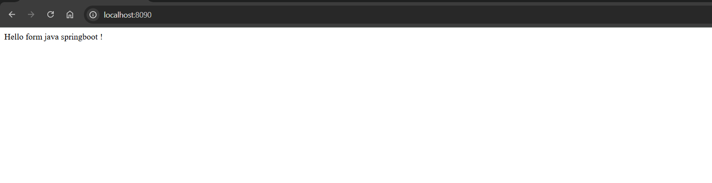
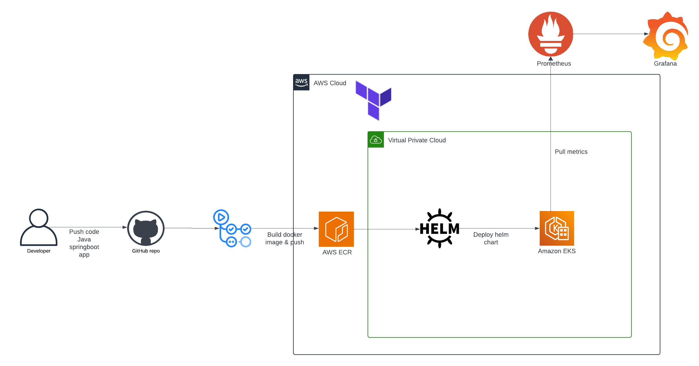
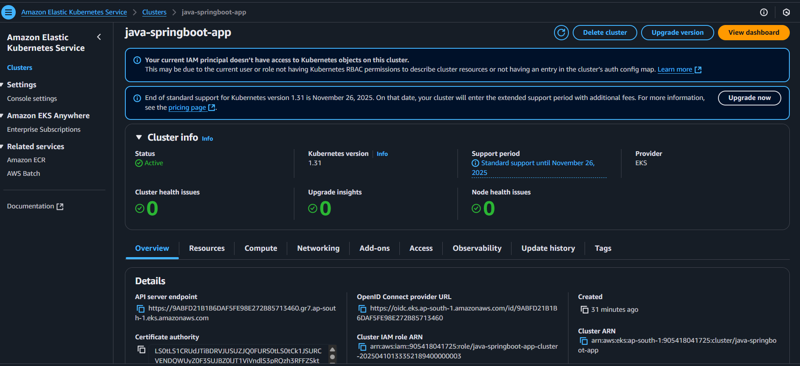

# java-spring-boot-app-treeleaf

This is the somple java springboot app which is dockerized & deployed into EKS cluster using helm

The docker image optimized for multi-stage build & was tested locally

### Build image
  ```hcl
  docker build -t java-springboot-app:latest .
  ```
### Deploy container
  ```hcl
  docker run -d --name -java-springboot-app -p 8090:8080 java-springboot-app
  ```
<p align="center">
  
</p>

## Architecture diagram
The application is deployed into aws EKS using helm chart. This architecture diagram shows the overview of entire process

The initial approach for deployment involves build the docker image via github action which is push into ECR, then helm chart deploys it into EKS cluster. For better monitoring prometheus scrapes the metrics from EKS which is then visualize in Grafana dashboard

The entire infrastructure in aws cloud is provisioned using Terraform:

Link: 
[terraform-java-springboot-infra](https://github.com/Ravi-Gupta77/terraform-java-springboot-infra.git)

<p align="center">
  
</p>

###screenshot
<p align="center">
  
</p>


